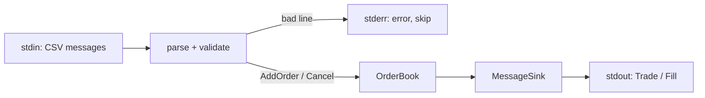
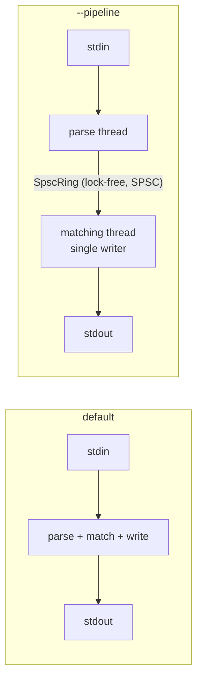
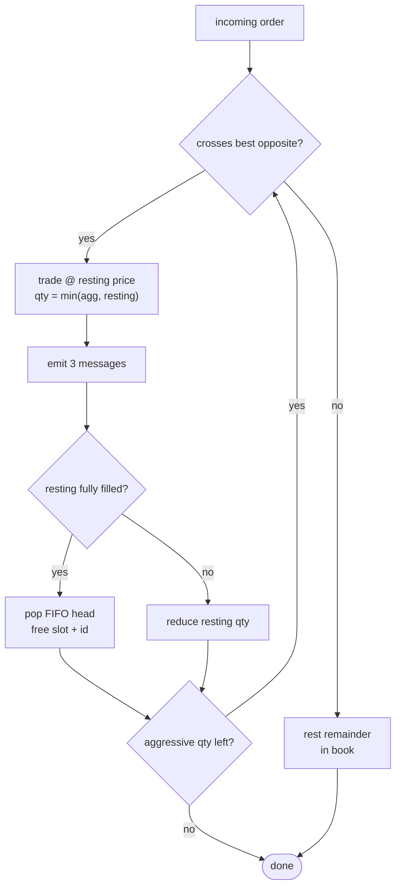

# Architecture at a glance

Visual companion to the README. Skim top-to-bottom in ~60 seconds.

## 1. Data flow



## 2. Threading: single-threaded book, lock-free only at the edge



> Determinism (price-time priority + atomic sweeps) needs a serial book.
> Scale by **one book per symbol across cores**, not by locking one book.

## 3. Order book (the core data structure)

```
        best ask = lowest set bit                 best bid = highest set bit
                 v                                          v
 askBitmap  0 0 1 0 0 0 1 ...                 bidBitmap ... 1 0 0 0 1 0 0
 (3-level)        |                                            |
                  | O(1) bit-scan                              | O(1) bit-scan
                  v                                            v
 askBand[]  [ . ][L][ . ]...[L]...            bidBand[]  [L]...[ . ][L][ . ]
 (array by tick)   |                                             |
                   v   per-level FIFO (oldest -> newest, intrusive prev/next)
            head ->[Node]->[Node]->[Node]<- tail
                    id      id      id
                    qty     qty     qty
                     ^
   OrderId --hash--> slot ---------+      idIndex: open-addressed, O(1) cancel
                                   v
   nodes_:  [ ====== pooled Node array  +  free-list (reused slots) ====== ]
            no new/delete on the hot path
```

Out-of-band prices (outside the array) fall back to an ordered `std::map`
(slow path) so **any** price is correct. Only speed depends on the band.

## 4. Matching loop



## 5. Output order, per matched pair

```
 ┌─────────────┐   ┌──────────────────────┐   ┌────────────────────┐
 │ 2  TradeEvent│ → │ 3/4  aggressive fill │ → │ 3/4  resting fill  │
 └─────────────┘   └──────────────────────┘   └────────────────────┘
   2,qty,price        full=3,id / part=4,id,q     full=3,id / part=4,id,q
```

## 6. Complexity cheat-sheet

| Operation                     | Cost            |
|-------------------------------|-----------------|
| Does an add match? (best px)  | **O(1)** bitmap |
| Each fill / remove filled     | **O(1)**        |
| Cancel                        | **O(1)** avg    |
| Rest a resting order (in-band)| **O(1)**        |
| Out-of-band level (fallback)  | O(log L)        |

## 7. Worked example: buy 3 @ 1050 sweeps the 1025 asks

```
   ASKS (before)            aggressive: BUY 3 @ 1050
   1075 | #1000000 (1)
   1050 | #1000003 (10)     step 1: trade 2 @ 1025 vs #1000005  -> agg=1, #1000005 gone
   1025 | #1000005 (2), #1000007 (5)   step 2: trade 1 @ 1025 vs #1000007 -> agg=0, #1000007=4
          ^oldest

   OUTPUT                   ASKS (after)
   2,2,1025                 1075 | #1000000 (1)
   4,1000008,1              1050 | #1000003 (10)
   3,1000005                1025 | #1000007 (4)
   2,1,1025
   3,1000008                (buy #1000008 fully filled, never rests)
   4,1000007,4
```

## 8. Measured (dev container; see README for caveats)

```
add (rest)  ~74 ns   |  cancel ~57 ns   |  add (match) ~159 ns   (amortized)
throughput: ~1.12M msg/s  single   ->   ~1.85M msg/s  --pipeline
```
